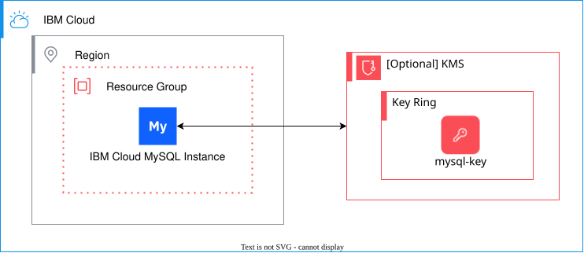

# Databases for MySQL - Fully Configurable (Gen2) Deployable Architecture

:exclamation: **Important:** This solution is not intended to be called by other modules because it contains a provider configuration and is not compatible with the `for_each`, `count`, and `depends_on` arguments. For more information, see [Providers Within Modules](https://developer.hashicorp.com/terraform/language/modules/develop/providers).

This architecture supports creating and configuring a Databases for MySQL instance with dedicated compute hosts (Gen2) and optional KMS encryption. Gen2 instances provide dedicated compute resources and enhanced performance characteristics compared to the classic multitenant model.

## Key Features

- **Dedicated Compute Resources (Gen2)**: Utilizes the latest VPC platform with dedicated compute hosts for predictable performance
- **Private Endpoints Only**: Gen2 instances support private endpoints exclusively for enhanced security
- **KMS Encryption**: Optional customer-managed encryption keys via Key Protect or Hyper Protect Crypto Services
- **Secrets Manager Integration**: Store service credentials securely in IBM Secrets Manager
- **Account-Level IAM Policies**: Gen2 requires account-level authorization policies (not resource-group scoped)

## Gen2 Limitations

The following features are **not supported** in Gen2 instances:
- Backup encryption keys (separate from deployment encryption)
- Admin password configuration
- Native MySQL users
- Database configuration parameters
- Auto-scaling
- Public or public-and-private service endpoints (private only)
- Backup restoration
- Read replicas
- Point-in-time recovery (PITR)

For these features, use the [fully-configurable (Classic)](../fully-configurable/) solution instead.

## Architecture Diagram

## Required IAM Access Policies

- **Resource Group**: Viewer access to the resource group where resources will be provisioned
- **Databases for MySQL**: Editor access to create and manage MySQL instances
- **Key Protect or HPCS** (if using KMS encryption): Editor access to create and manage encryption keys
- **Secrets Manager** (if using): Editor access to create and manage secrets

## Notes

- Gen2 instances use the `standard-gen2` plan
- Memory and CPU are determined by the `member_host_flavor` selection
- All Gen2 instances use private endpoints only
- IAM authorization policies for KMS are created at the account level (not resource-group scoped)
